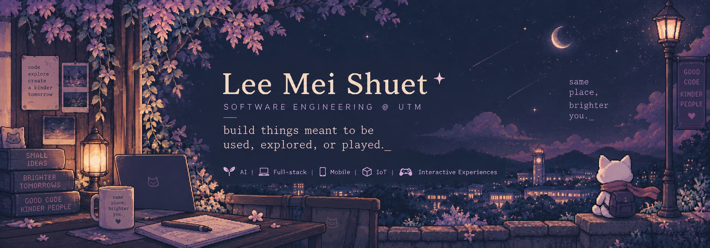
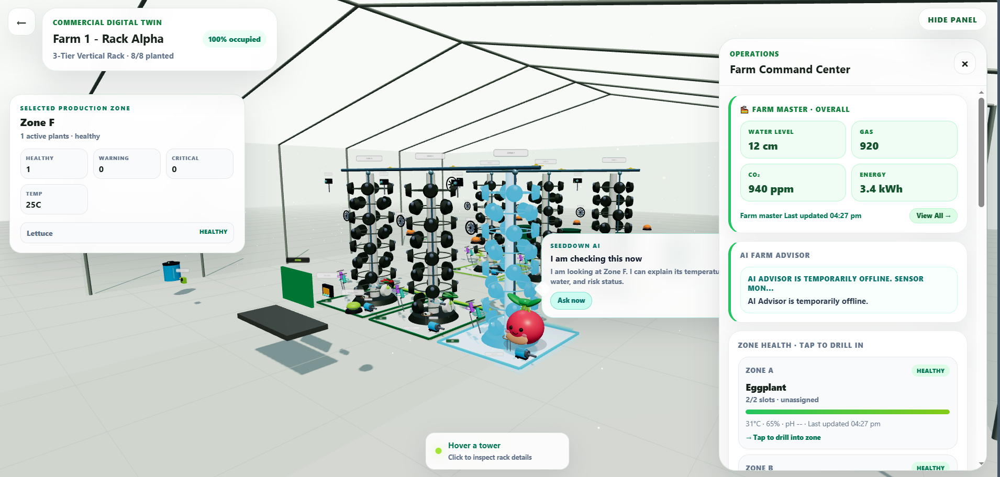
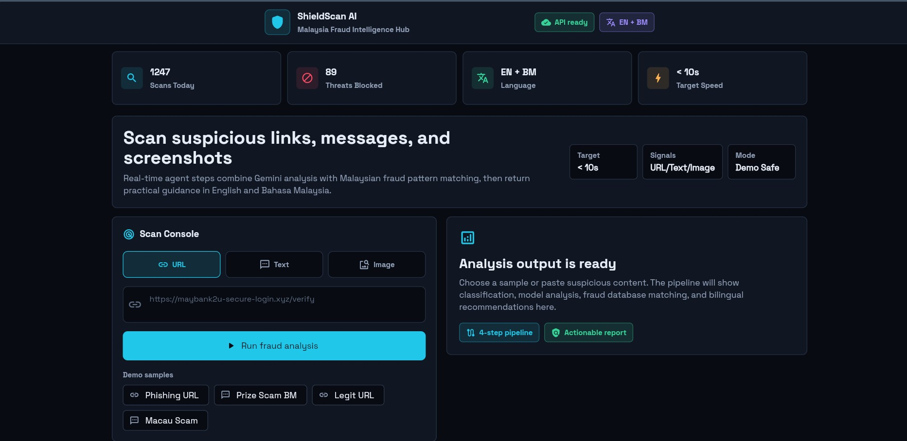

### 💫 About Me:

👋 Hi, I'm **Lee Mei Shuet** — a Year 3 Software Engineering student at **Universiti Teknologi Malaysia**, hackathon builder, and creator of **Walk Back Home**.

I like building things that are meant to be **used, explored, or played** — from AI-powered mobile products and IoT systems to an indie memory RPG built from my own diary.

Great code, to me, is a lot like a good badminton match: strategy, agility, and clean execution. 🏸  
When I'm not building apps or experimenting with AI, you'll probably find me cycling around UTM or admiring 16-bit retro pixel art. 👾

### ✨ Highlights

- 🏆 **CodeNection 2025 Champion** — shipped a smart-campus mobile product under hackathon pressure.
- 🌱 **Award-winning AI + IoT builder** — SeedDown received the **DIGITEX 2026 Netizen's Choice Award**, was a **2nd Smart Earth Hackathon Finalist**, and an **UTMxHackathon '26 Top 10 Finalist**.
- 🌲 **Indie project creator** — built **Walk Back Home**, a browser + Android personal memory RPG with authored interactive chapters.
- 🧠 **Product-minded engineer** — comfortable moving between mobile, full-stack, AI, IoT, product design, workflow automation, and rapid prototyping.

---

## ✨ Featured Work

<table>
<tr>
<td width="50%" valign="top">

### 🏆 UTMBright
**🏆 CodeNection 2025 Champion**

Smart-campus mobile platform for student safety, mobility, emergency support, and campus life.

`Flutter` `Firebase` `AI`

[Repository](https://github.com/jiahui-1101/CodeNection) · [▶ Demo](https://youtu.be/3rg5cUewwSQ) · [📱 APK](https://github.com/jiahui-1101/CodeNection/releases/tag/UTMBright-v2.0)

</td>
<td width="50%" valign="top">

### 🌲 Walk Back Home
**Personal Project · Creator & Developer**

*What if your diary was not something you read, but somewhere you could return to?*

A browser + Android personal memory RPG that turns diary entries into explorable authored chapters, built on a reusable TypeScript game/runtime system.

`TypeScript` `Vite` `Capacitor` `Supabase`

[Repository](https://github.com/meishuet16/ms-walk-back-home) · [▶ Play Live](https://ms-walk-back-home.vercel.app) · [📱 APK](https://github.com/meishuet16/ms-walk-back-home/releases/tag/v0.1.0-alpha)

</td>
</tr>

<tr>
<td width="50%" valign="top">

### 🌱 SeedDown
**🏆 DIGITEX 2026 Netizen's Choice Award**  
**🏅 2nd Smart Earth Hackathon Finalist**  
**🏅 UTMxHackathon '26 Top 10 Finalist**

AI + IoT vertical-farming platform turning live sensor data into grower-facing insights and decisions.

`AI` `IoT` `Firebase` `ESP32`

[Repository](https://github.com/jiahui-1101/SeedDown) · [▶ Live Prototype](https://seed-down.vercel.app)

</td>
<td width="50%" valign="top">

### 🛡️ ShieldScan AI
**Project 2030 Hackathon · Secure Digital Track**

Multimodal fraud intelligence for suspicious URLs, text, and screenshots with streamed, explainable bilingual risk reports.

`Flutter Web` `FastAPI` `Gemini 2.5 Flash` `Vertex AI RAG`

[Repository](https://github.com/meishuet16/shieldscan) · [▶ Live Demo](https://shieldscan-frontend.onrender.com) · [▶ Pitch](https://youtu.be/ghL32WbbNEw)

</td>
</tr>
</table>

---

## 🗂️ More Projects

### 🏁 Competition & Product Builds

| Project | Event / Context | What I worked on |
|---|---|---|
| [**Warung Wise**](https://github.com/meishuet16/Warung-Wise) | KitaHack 2026 | AI bookkeeping and financial intelligence for Malaysian micro-hawkers: receipt understanding, voice ledger, profit intelligence, loan simulation, and P&L reporting. |
| [**PAYUNG**](https://github.com/meishuet16/GodamLah2.0) | GodamLah2.0 | Offline-first disaster-response concept around identity, health profiles, victim/rescuer workflows, and pitch direction. |
| [**EcoRabbit**](https://github.com/jiahui-1101/SDG-XI-Hackathon) | SDG XI Hackathon | Sustainable housing assistant with commute-first recommendations, SDG 11 framing, and AI-assisted insights. |
| [**NextTalent**](https://github.com/jiahui-1101/Talentbank_Tech_Hackathon) | Talentbank Tech Hackathon | UI and prototype work for a talent-tech product focused on retention signals and employee/candidate experience. |

### 🤖 AI, Automation & Systems

| Project | Focus |
|---|---|
| [**Revenue Assurance Investigation Agent**](https://github.com/meishuet16/ms-revenue-assurance-agent) | Snowflake-oriented revenue assurance workflow that detects billing variances, validates commercial evidence, and prepares auditable finance-review cases with deterministic SQL, agent skills, Cortex Search-ready evidence, and a Streamlit dashboard. |
| [**CareHub AI**](https://github.com/meishuet16/CareHubAI) | AI-assisted smart bedside nursing prototype combining pressure-ulcer risk monitoring, IV drip status, alert prioritization, a nurse-station dashboard, and ESP32 hardware-mode support. |

### 🤝 Collaborative & Academic Projects

| Project | What I worked on |
|---|---|
| [**Tree Mapping Data System**](https://github.com/jiahui-1101/Tree_Mapping_Data_System) | Johor Botanical Garden full-stack prototype covering role-based workflows, tree inventory, ranger field operations, visitor education, QR access, and map/visualization features. |
| [**EventOra**](https://github.com/Christting/EventOra) | Campus event management and ticketing platform covering registration, ticket wallet, QR check-in, organiser dashboards, feedback, notifications, and Vue + Slim + MySQL integration. |
| [**Event Registration & Check-In System**](https://github.com/jiahui-1101/Event-Registration-and-Check-In-System) | C++ event registration/check-in workflows using queues and singly linked lists, including waiting-list logic, search/sort, admin flows, and file persistence. |

<b>💻 Coursework & smaller builds</b>

 

| Project | Focus |
|---|---|
| [**Employee Directory**](https://github.com/meishuet16/Employee-Directory-with-Vue-3-Axios-Express-and-MySQL) | Vue 3 + Axios + Express + MySQL CRUD/search/sort application. |
| [**Student Records Manager**](https://github.com/meishuet16/Student-Records-Manager-with-Vue-3-Axios-Express-and-MySQL) | Database-backed records manager using Vue 3, Axios, Express, and MySQL. |
| [**Real-Time Data Dashboard**](https://github.com/meishuet16/lab3_-Real-Time-Data-Dashboard-with-Fetch-API-jQuery-) | Fetch API, jQuery, DOM updates, and browser-side data interaction. |
| [**Kanban Style Task Manager**](https://github.com/meishuet16/Lab2-Kanban-Style-Task-Manager) | Interactive task state, movement, and frontend layout. |
| [**QuickNote Dashboard**](https://github.com/meishuet16/QuickNote_dashboard-BOM-DOM-lab-activity-) | BOM/DOM manipulation and note-dashboard interactions. |
| [**HTML Lab Exercise 1**](https://github.com/meishuet16/html-lab-exercise1) | Foundational HTML/CSS coursework. |

## 🌐 Socials:

  

# 💻 Tech Stack:

**Languages**

        

**Mobile, Frontend & UI**

    

**Backend, Data & Cloud**

        

**AI, IoT & Tools**

     

# 📊 GitHub Stats:

 

 

## 🏆 GitHub Trophies

### ✍️ Random Dev Quote

### 🔝 Top Contributed Repo

